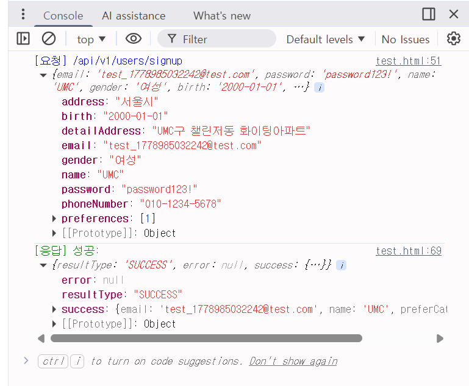

# Niz_Week8_Practice

#### 1) CORS 알아보기

### 1. SOP (동일 출처 정책)

- 웹 브라우저(크롬, 사파리 등)는 기본적으로 보안을 위해 **'출처(Origin)'가 다른 곳으로는 데이터 요청을 보내지 못하도록 차단**함.
- 예를 들어, 프론트엔드(`https://neordinary.co.kr`)에서 백엔드 서버(`https://api.umc.com`)로 요청을 보내면, 주소가 다르기 때문에 브라우저가 기본적으로 이 요청을 막아버림.

### 2. CORS (Cross-Origin Resource Sharing)

- SOP로 인해 막혀있는 **서로 다른 주소 간의 통신을 안전하게 허용해 주는 보안 메커니즘.**
- 실제 서비스에서는 프론트엔드와 백엔드가 서로 다른 도메인에 배포되는 경우가 대부분이므로, 서버 측에서 이 CORS 설정을 통해 프론트엔드의 접근을 허락해 주어야만 통신이 가능해짐.

### 3. Preflight (사전 요청)

- 브라우저는 다른 출처의 요청이 위험할 수 있기 때문에, 먼저 **`OPTIONS` 메서드를 이용해 "나 이거 보내도 돼?"라고 서버에 허락을 구함.**
- 서버는 이 사전 요청에 대해 허용하는 주소(`Access-Control-Allow-Origin`), 허용하는 메서드(`Access-Control-Allow-Methods`) 등의 **응답 헤더**를 내려줌.

---

### Case 1. 가장 흔한 기본 에러

> `No 'Access-Control-Allow-Origin' header is present...`
> 
- **원인:** 백엔드 서버에 CORS 설정 자체가 없거나, 허용되지 않은 프론트엔드 주소에서 요청이 왔을 때 발생.
- **해결:** 특정 프론트엔드 주소만 허용하도록 `origin` 값을 명시.

### Case 2. 커스텀 헤더 에러

> `Request header field x-auth-token is not allowed...`
> 
- **원인:** 프론트엔드가 요청을 보낼 때, 브라우저 기본 헤더가 아닌 우리가 만든 특별한 헤더(`x-auth-token`, `Authorization` 등)를 넣어서 보냈는데 서버가 이를 허락하지 않았을 때 발생.
- **해결:** `allowedHeaders` 설정에 프론트엔드가 보내는 헤더 이름을 추가.

### Case 3. 자격 증명(쿠키/토큰) 에러

> `The value of the 'Access-Control-Allow-Origin' header must not be the wildcard '*' when the request's credentials mode is 'include'.`
> 
- **원인:** 프론트엔드가 **쿠키나 인증 정보**를 담아서 요청(fetch API의 `credentials: 'include'`)을 보냈는데, 백엔드가 `origin: '*'` (모두 허용)로 설정해 둔 경우.
- **해결:** 브라우저는 보안상 쿠키가 오갈 때는 절대 `*`를 허용하지 않음! **정확한 프론트엔드 주소를 명시**하고, **`credentials: true`** 옵션을 반드시 켜주어야 함.

---

#### 2) CORS 오류 실습해보기

---

#### 3) Swagger 설정하는 방법 알아보고 설정하기 With TSOA

---