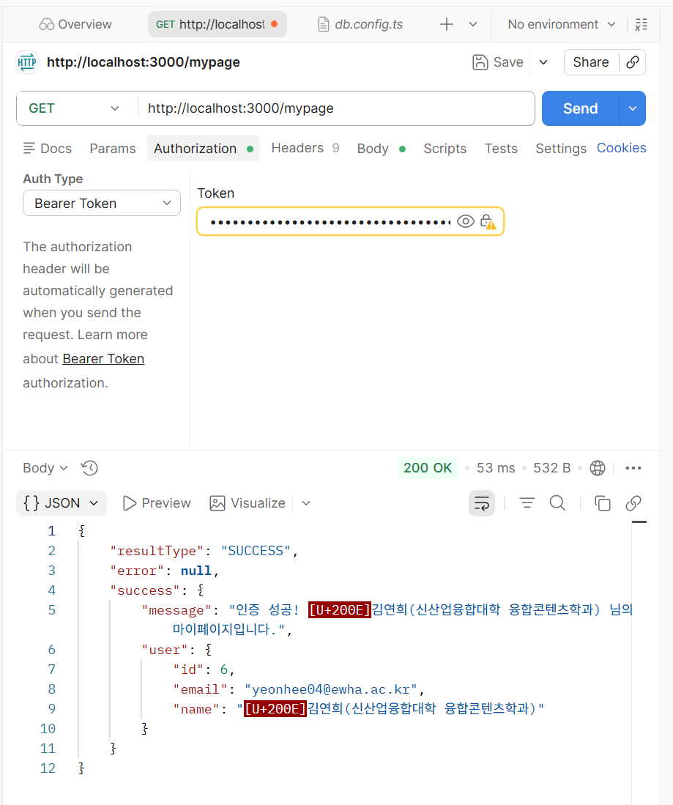

# Niz_Week9_Practice

## 인증(Authentication) vs 인가(Authorization) , 그리고 Token

### 1. 인증(Authentication) vs 인가(Authorization)

- **인증(Authentication):** "당신은 누구십니까?"를 확인하는 과정.
아이디와 비밀번호를 입력해서 로그인하는 행위.
- **인가(Authorization):** "이걸 할 권한이 있나요?"를 확인하는 과정. 로그인을 마친 사용자(인증된 사용자)가 '일반 유저'인지 '관리자'인지 확인하여 권한을 부여함.
- **핵심 규칙:** 항상 **인증이 먼저 이루어지고, 그 다음 인가** 절차를 거침.

### 2. JWT (JSON Web Token)란?

- '세션(Session)' 방식: 기존에는 서버가 사용자의 로그인 상태를 직접 기억해야 했음
- **JWT:** 사용자의 정보를 담은 JSON 객체를 암호화 서명하여 만든 '위조 불가능한 신분증'.
- JWT는 `.`(점)을 기준으로 세 부분으로 나뉨.
    1. **Header (헤더):** 토큰의 타입과 서명 알고리즘(예: HS256) 정보가 들어감.
    2. **Payload (페이로드):** `userId`나 `email` 등 사용자를 식별할 실제 정보가 들어감.
    단, 쉽게 디코딩이 가능하므로 **비밀번호 같은 민감한 정보는 절대 넣으면 안 됨**.
    3. **Signature (서명):** 서버의 '비밀 키'로 만들어지며, 이 토큰이 위조되지 않았음을 100% 증명하는 핵심 역할.

### 3. Access Token & Refresh Token의 완벽한 흐름

- **Access Token (단기 출입증):** 수명이 아주 짧으며(예: 1시간), 평소 API 요청 시 헤더에 실어 보냄. 수명이 짧아 탈취당해도 피해가 적음.
- **Refresh Token (출입증 재발급용):** 수명이 길고 안전한 곳에 보관하며, 오직 **새로운 Access Token을 발급받을 때만 사용**함.

---

## OAuth 2.0 알아보기

### OAuth 2.0 (소셜 로그인) 4단계 핵심 흐름

**1. 사용자 로그인 및 동의 (User login & consent)**

- 사용자가 "구글로 로그인" 버튼을 누르면 구글 로그인 창으로 이동.
- 로그인을 마치면 "이 앱이 당신의 이메일과 프로필 정보를 요청합니다. 동의하십니까?"라는 권한 동의 화면이 뜨고, 사용자가 이를 수락하는 단계.

**2. 권한 코드 발급 (Authorization code)**

- 동의를 마친 사용자를 구글 서버가 서버의 특정 주소(Callback URL)로 다시 돌려보냄.
- 이때 빈손으로 돌려보내지 않고, 브라우저 URL 주소 뒤에 일회용 인증 번호 같은 `code` (Authorization code)를 붙여서 보냄.

**3. 코드를 토큰으로 교환 (Exchange code for token)**

- 서버는 URL에 묻어온 이 일회용 `code`를 낚아채, 다시 구글 서버로 보냄.
- "저한테 코드 잘 받아왔어! 이제 진짜 **구글 Access Token**으로 바꿔줘!" 하고 진짜 토큰과 교환하는 단계.

**4. 유저 정보 요청 (Use token to call API)**

- 이제 서버는 구글 Access Token을 쥐고 구글 API를 호출함.
- "이 토큰 보여줄 테니까, 아까 로그인한 유저 이메일이랑 이름 좀 줘!" 라고 요청해서 진짜 유저 데이터를 서버로 가져오게 됨.

---

## Google Login 구현해보기

